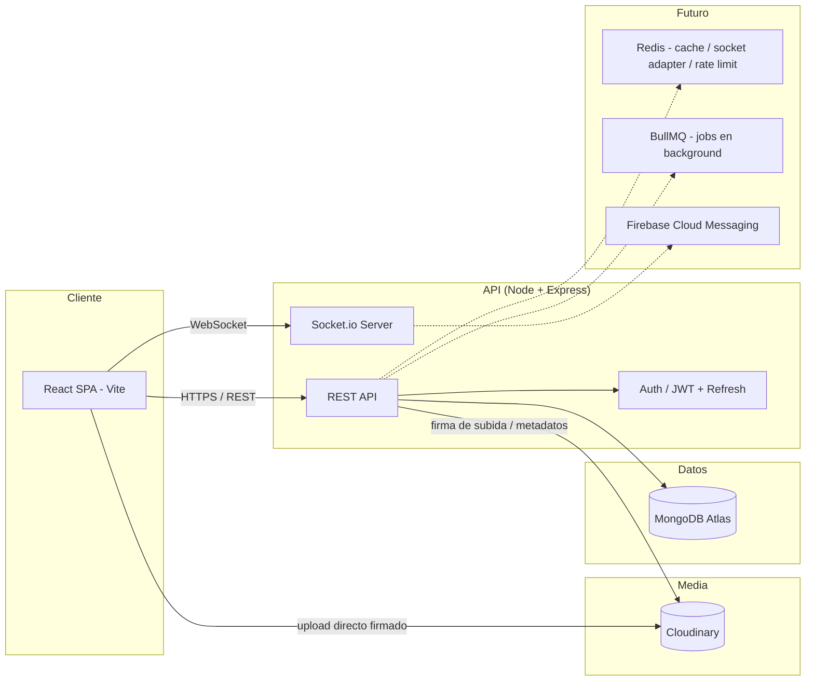
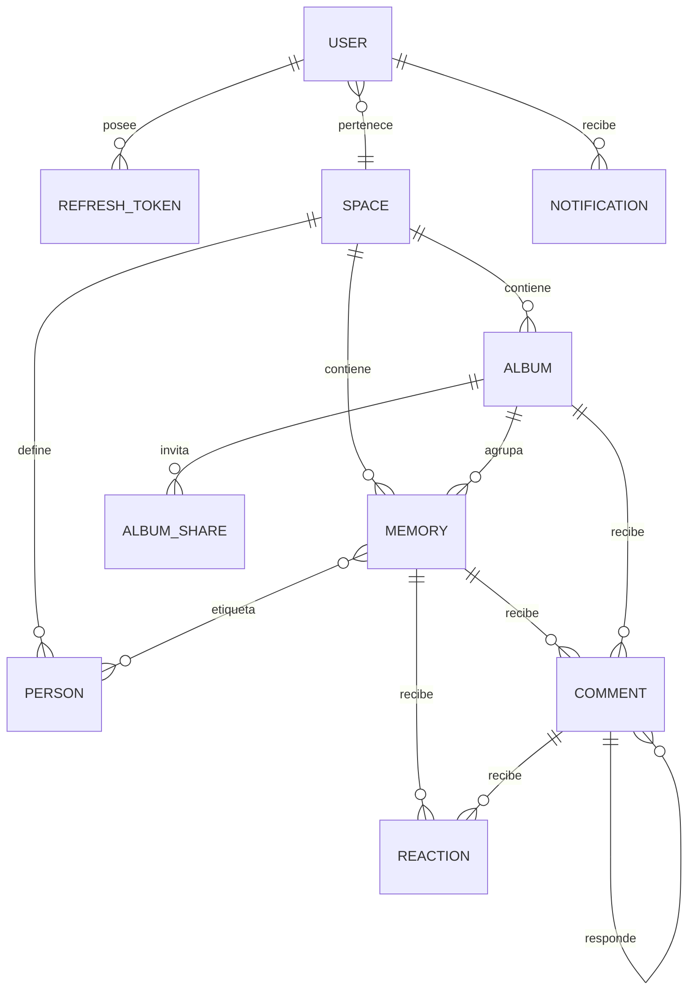
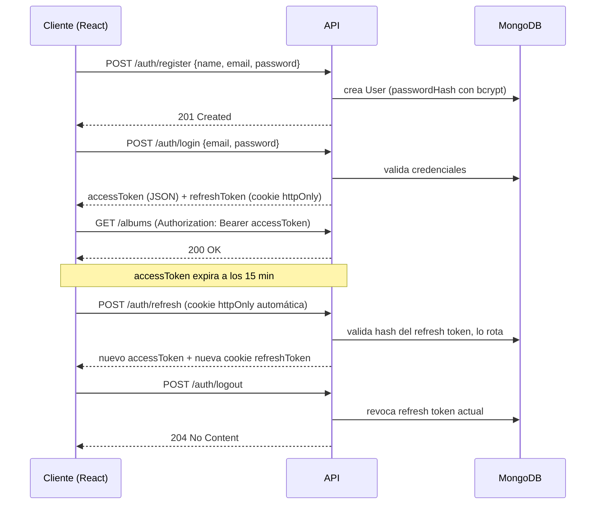
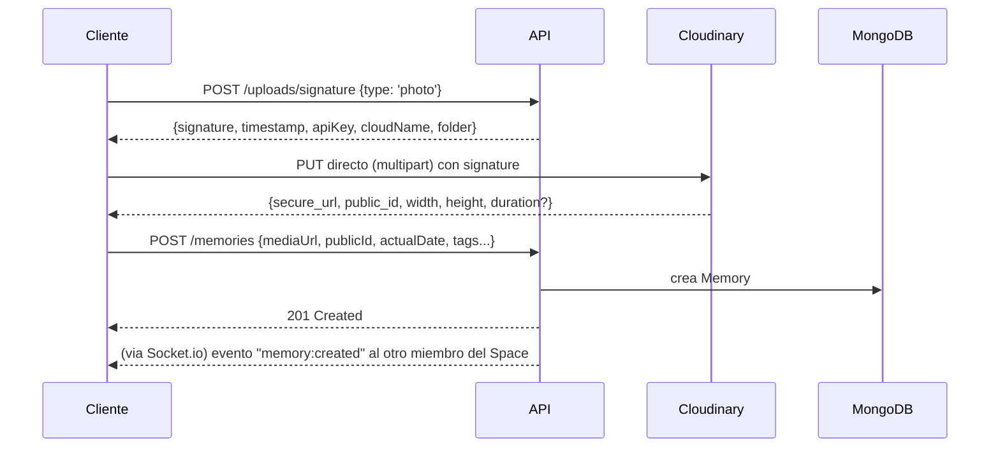

# Memories App — Documento de Producto y Arquitectura

> Estado: **Borrador v1 — pendiente de tu aprobación antes de escribir código.**
> Nombre de trabajo provisional: **"Nosotros"** (puedes cambiarlo cuando quieras, no afecta a nada técnico todavía).

---

## Índice

1. [Visión general](#1-visión-general)
2. [Decisiones de arquitectura y alternativas propuestas](#2-decisiones-de-arquitectura-y-alternativas-propuestas)
3. [Arquitectura de alto nivel](#3-arquitectura-de-alto-nivel)
4. [Estructura de carpetas](#4-estructura-de-carpetas)
5. [Modelo de datos (MongoDB)](#5-modelo-de-datos-mongodb)
6. [Diagrama de relaciones (ER)](#6-diagrama-de-relaciones-er)
7. [Flujo de autenticación](#7-flujo-de-autenticación)
8. [Flujo de subida de fotos/vídeos](#8-flujo-de-subida-de-fotosvídeos)
9. [Diseño de la API REST](#9-diseño-de-la-api-rest)
10. [El editor visual de álbumes (freeform layout)](#10-el-editor-visual-de-álbumes-freeform-layout)
11. [Roadmap por fases](#11-roadmap-por-fases)
12. [Riesgos técnicos y mitigación](#12-riesgos-técnicos-y-mitigación)
13. [Rendimiento, seguridad y escalabilidad](#13-rendimiento-seguridad-y-escalabilidad)
14. [Próximo paso](#14-próximo-paso)

---

## 1. Visión general

**Nosotros** es un diario digital privado pensado para **dos personas** (pareja), que combina:

- La fiabilidad de almacenamiento de **Google Photos**
- La libertad visual de **Pinterest / Canva**
- La organización y personalización de **Notion**
- La calidez de un **álbum físico** hecho a mano

### Pilares del producto

| Pilar | Qué significa en la práctica |
|---|---|
| **Privacidad primero** | Solo tú y tu pareja (y quien invitéis explícitamente) veis el contenido. Nada es público por defecto. |
| **Libertad de organización** | Los álbumes no son una cuadrícula fija: es un lienzo editable, como Canva/Figma. |
| **Contexto emocional** | Cada recuerdo puede llevar fecha real, personas, emociones, ubicación — no es solo "una foto más". |
| **Fluidez** | Micro-animaciones, transiciones compartidas, skeletons, cero saltos bruscos. |
| **Personalización total** | Tema, color, tipografía, densidad — la app se adapta a vosotros, no al revés. |

### Modelo mental clave: el "Space"

En vez de pensar en "usuarios que comparten contenido entre sí" de forma suelta, introduzco un concepto nuevo que no mencionabas explícitamente pero que **simplifica todo el sistema de permisos**: el **Space** (espacio compartido / "pareja").

- Un `Space` tiene 2 (o más, a futuro) miembros.
- Todo álbum y recuerdo pertenece a un `Space`, no a un usuario individual.
- Esto convierte "compartir con mi pareja" en algo automático (todo lo que subes ya es del Space) y dejas el sistema de invitaciones/permisos solo para casos especiales (invitar a un tercero a un álbum concreto, compartir un álbum de forma pública/solo lectura, etc).

Lo explico en detalle en la sección 2, es la primera decisión importante que quiero que valides.

---

## 2. Decisiones de arquitectura y alternativas propuestas

Pediste que si veo una solución mejor te la explique en vez de aplicar tu propuesta literal. Aquí las decisiones donde me aparto o afino la idea original, con la razón:

### 2.1 Introducir la entidad `Space` (pareja) en vez de solo `User` + relaciones sueltas

- **Tu propuesta implícita:** cada recurso guarda `createdBy` y los usuarios "comparten contenido entre ellos".
- **Problema:** sin una entidad que agrupe a la pareja, cada álbum necesitaría una lista de `sharedWith` gestionada a mano, y "vuestro" contenido común no tiene un dueño natural. Las estadísticas ("tiempo juntos", "recuerdos totales") tampoco tendrían un ámbito claro.
- **Propuesta:** un `Space` con `members: [{ user, role }]`. Álbumes y recuerdos llevan `spaceId`. El sistema de compartir (invitar a un tercero, álbum de solo lectura) se construye **encima** de esto como una capa opcional (`AlbumShare` / `permissions`), no como el mecanismo base.
- **Beneficio extra:** en el futuro, si un día quisieras un Space familiar (padres, amigos), el modelo ya lo soporta sin rediseñar nada.

### 2.2 Cloudinary primero, S3 después (no ambos desde el día 1)

- **Tu propuesta:** "Amazon S3 o Cloudinary".
- **Decisión:** empezar con **Cloudinary**. Motivo: incluye CDN, generación automática de miniaturas, transformaciones on-the-fly (`w_400,h_400,c_fill,q_auto,f_auto`), streaming adaptativo de vídeo y subida directa desde el cliente firmada — todo esto con S3 lo tendrías que construir vosotros (Lambda@Edge, CloudFront, un pipeline de Sharp, etc).
- **Cómo no quedarnos atrapados:** todo el acceso a almacenamiento pasa por una interfaz `MediaStorageService` (patrón *Strategy*). El día que el volumen de datos justifique migrar a S3 (por coste), se implementa un segundo adaptador sin tocar el resto de la app.
- **Dónde sigue entrando Sharp:** generación de *blurhash*/placeholders, composición de portadas de álbum a partir de varias fotos, y cualquier procesado que Cloudinary no cubra bien. Sharp corre en el backend como utilidad, no como pipeline principal de subida.

### 2.3 Subida directa a Cloudinary desde el cliente (no proxy por nuestro servidor)

- **Problema con subir "foto → nuestro servidor → Cloudinary":** duplicas el tráfico, tu servidor se convierte en cuello de botella y gasta memoria/CPU con archivos grandes (vídeos).
- **Propuesta:** el backend genera una **firma de subida temporal** (signed upload), el cliente sube el archivo **directamente** a Cloudinary, y al terminar informa al backend con el `public_id` y metadatos para crear el `Memory`. Multer + Sharp se quedan para casos especiales (ej. avatar de perfil, donde el archivo es pequeño y queremos procesarlo nosotros).

### 2.4 Backend: módulos por *feature*, no carpetas por *tipo* a nivel raíz

- **Tu propuesta:** carpetas `controllers/`, `routes/`, `services/`, `repositories/`, `models/`, etc. a nivel raíz.
- **Problema a escala:** con 10+ entidades (auth, users, spaces, albums, memories, comments, reactions, notifications, sharing, stats...), acabas con archivos `albums.controller.ts`, `albums.service.ts`, `albums.repository.ts` dispersos en carpetas distintas — cuesta más navegar y viola la cercanía de lo que cambia junto.
- **Propuesta (híbrida):** cada módulo (`modules/albums/`) contiene sus propios `controller`, `routes`, `service`, `repository`, `model`, `dto`, `validators` — **manteniendo exactamente los mismos nombres de capa que pediste**, solo agrupados por dominio. `middlewares/`, `config/` y `utils/` sí quedan compartidos a nivel raíz porque son transversales.

### 2.5 TypeScript de punta a punta + paquete de tipos compartido (monorepo)

- Pediste TS "preferiblemente" — lo fijo como estándar, no opcional, porque el modelo de datos es complejo (recursos polimórficos, layouts) y sin tipos compartidos frontend/backend vais a duplicar interfaces y desincronizarlas.
- **Propuesta:** monorepo con `pnpm workspaces`: `apps/web`, `apps/api`, `packages/shared` (tipos TS + esquemas de validación `zod` reutilizados en cliente y servidor: mismo esquema valida el formulario en React y el body en Express).

### 2.6 Vitest + Playwright como alternativa a Jest + Cypress (a valorar)

- Jest funciona perfectamente, pero al usar **Vite**, **Vitest** comparte config con el build (transformadores, alias, `import.meta.env`) y es notablemente más rápido. Para el backend Node, Jest sigue siendo una opción totalmente válida.
- Playwright frente a Cypress: mejor soporte multi-navegador, más rápido en paralelo, TypeScript de primera clase.
- **No es bloqueante** — si prefieres mantener Jest/Cypress tal cual porque ya los conoces, lo dejamos así. Te lo señalo como recomendación, decides tú.

### 2.7 Undo/Redo y edición simultánea del álbum

- Con dos personas editando el mismo álbum, puede haber conflictos. Para el MVP: **"último en guardar gana"** con un campo `version` (optimistic concurrency) que avisa si alguien más editó mientras tanto. Edición colaborativa en tiempo real (tipo Figma, con cursores) la dejo como *stretch goal* de v3 — es un problema de otra magnitud (CRDTs / operational transform) que no conviene mezclar con el MVP.

---

## 3. Arquitectura de alto nivel



**Despliegue recomendado:**

| Componente | Servicio sugerido | Motivo |
|---|---|---|
| Frontend | Vercel | Deploy inmediato, preview por PR, CDN global |
| Backend (API + Socket.io) | Render / Fly.io | Necesitan conexiones persistentes (WebSocket); evitar serverless puro (Vercel Functions) para el socket server |
| Base de datos | MongoDB Atlas (M0 gratis para MVP) | Backups automáticos, escalado gestionado |
| Media | Cloudinary (plan free/plus) | CDN + transformaciones incluidas |
| Cache / colas (v2+) | Upstash Redis | Sin servidor, barato, soporta el adaptador de Socket.io si escalamos a >1 instancia |

---

## 4. Estructura de carpetas

### 4.1 Frontend (`apps/web`) — arquitectura *feature-based*

```
apps/web/
├─ src/
│  ├─ app/
│  │  ├─ providers/          # QueryClientProvider, ThemeProvider, AuthProvider...
│  │  └─ router/              # definición de rutas + guards
│  ├─ features/
│  │  ├─ auth/
│  │  │  ├─ api/               # llamadas HTTP específicas
│  │  │  ├─ components/
│  │  │  ├─ hooks/
│  │  │  ├─ pages/
│  │  │  ├─ store/
│  │  │  └─ types/
│  │  ├─ spaces/                # gestión del "Space" (pareja), invitaciones
│  │  ├─ albums/
│  │  │  └─ components/editor/  # canvas, drag&drop, resize, capas, toolbar
│  │  ├─ memories/
│  │  ├─ timeline/
│  │  ├─ calendar/
│  │  ├─ search/
│  │  ├─ stats/
│  │  ├─ notifications/
│  │  ├─ comments/
│  │  └─ settings/               # personalización / tema
│  ├─ components/                 # UI compartida (Button, Modal, Avatar, Skeleton...)
│  ├─ layouts/
│  ├─ hooks/                       # hooks transversales (useDebounce, useMediaQuery...)
│  ├─ services/                     # axios instance, socket client, storage client
│  ├─ store/                         # slices Zustand globales (theme, session)
│  ├─ contexts/
│  ├─ utils/
│  ├─ constants/
│  ├─ types/
│  ├─ styles/
│  └─ main.tsx
├─ index.html
├─ vite.config.ts
├─ tailwind.config.ts
└─ tsconfig.json
```

### 4.2 Backend (`apps/api`) — módulos por dominio

```
apps/api/
├─ src/
│  ├─ config/                # env, db, cloudinary, socket, cors
│  ├─ modules/
│  │  ├─ auth/
│  │  │  ├─ auth.controller.ts
│  │  │  ├─ auth.routes.ts
│  │  │  ├─ auth.service.ts
│  │  │  ├─ auth.repository.ts
│  │  │  ├─ auth.validators.ts   # zod
│  │  │  └─ dto/
│  │  ├─ users/
│  │  ├─ spaces/
│  │  ├─ albums/
│  │  ├─ memories/
│  │  ├─ comments/
│  │  ├─ reactions/
│  │  ├─ notifications/
│  │  ├─ sharing/
│  │  ├─ stats/
│  │  └─ uploads/
│  ├─ middlewares/            # auth, errorHandler, rateLimit, validate(zod), notFound
│  ├─ services/                # cross-cutting: mediaStorage, socket, mailer
│  ├─ utils/
│  ├─ types/
│  ├─ app.ts
│  └─ server.ts
└─ tests/
```

### 4.3 Compartido

```
packages/shared/
├─ src/
│  ├─ types/        # interfaces TS: User, Album, Memory, etc.
│  └─ schemas/       # esquemas zod reutilizados en front y back
```

---

## 5. Modelo de datos (MongoDB)

> Notación: TypeScript interfaces (documentación del esquema, no el código Mongoose final).

```ts
// User
interface User {
  _id: ObjectId;
  name: string;
  email: string;
  passwordHash: string;
  avatarUrl?: string;
  spaceId?: ObjectId;          // Space al que pertenece (puede ser null antes de emparejarse)
  preferences: {
    theme: 'light' | 'dark' | 'system';
    accentColor: string;
    secondaryColor: string;
    fontFamily: string;
    borderRadius: 'none' | 'sm' | 'md' | 'lg' | 'full';
    density: 'compact' | 'comfortable' | 'spacious';
    backgroundImage?: string;
    animationsEnabled: boolean;
  };
  createdAt: Date;
  updatedAt: Date;
}

// RefreshToken (para poder revocar sesiones individuales)
interface RefreshToken {
  _id: ObjectId;
  userId: ObjectId;
  tokenHash: string;           // nunca se guarda en claro
  deviceInfo?: string;
  expiresAt: Date;
  revokedAt?: Date;
  createdAt: Date;
}

// Space ("la pareja")
interface Space {
  _id: ObjectId;
  name: string;                 // ej. "Ana & Luis"
  members: Array<{
    userId: ObjectId;
    role: 'owner' | 'member';
    joinedAt: Date;
  }>;
  inviteCode: string;            // código para emparejar al segundo usuario
  anniversaryDate?: Date;         // para "tiempo juntos" en estadísticas
  createdAt: Date;
}

// Album
interface Album {
  _id: ObjectId;
  spaceId: ObjectId;
  title: string;
  description?: string;
  coverUrl?: string;
  color?: string;
  icon?: string;
  backgroundStyle?: { type: 'color' | 'gradient' | 'image'; value: string };
  visibility: 'private' | 'shared';
  isFavorite: boolean;
  isArchived: boolean;
  tags: string[];
  createdBy: ObjectId;
  layout: AlbumLayoutItem[];      // ver sección 10
  version: number;                 // optimistic concurrency
  createdAt: Date;
  updatedAt: Date;
}

interface AlbumLayoutItem {
  memoryId: ObjectId;
  x: number; y: number;            // posición en unidades de grid
  w: number; h: number;             // tamaño en columnas/filas
  rotation: number;                  // grados, ej. -3 a 3
  zIndex: number;
  borderRadius?: number;
  shadow?: 'none' | 'sm' | 'md' | 'lg';
  locked?: boolean;
}

// Memory (recurso: foto, vídeo, nota, ubicación...)
interface Memory {
  _id: ObjectId;
  spaceId: ObjectId;
  albumId?: ObjectId;               // puede existir suelto, fuera de un álbum
  type: 'photo' | 'video' | 'text' | 'location' | 'audio';
  title?: string;
  description?: string;
  mediaUrl?: string;                 // Cloudinary secure_url
  mediaPublicId?: string;             // para poder transformar/borrar
  thumbnailUrl?: string;
  blurhash?: string;                   // placeholder mientras carga
  tags: string[];
  people: ObjectId[];                    // ref a Person
  emotions: string[];                     // ej. ['feliz', 'nostalgia']
  location?: { name: string; coordinates: [number, number] }; // GeoJSON [lng, lat]
  isFavorite: boolean;
  actualDate: Date;                        // cuándo ocurrió de verdad
  createdAt: Date;                          // cuándo se subió
  createdBy: ObjectId;
  updatedAt: Date;
}

// Person (persona etiquetable, para filtros)
interface Person {
  _id: ObjectId;
  spaceId: ObjectId;
  name: string;
  avatarUrl?: string;
}

// Comment (polimórfico: memoria o álbum)
interface Comment {
  _id: ObjectId;
  spaceId: ObjectId;
  targetType: 'memory' | 'album';
  targetId: ObjectId;
  authorId: ObjectId;
  text: string;
  parentCommentId?: ObjectId;    // respuestas
  createdAt: Date;
  editedAt?: Date;
}

// Reaction (polimórfica: memoria o comentario)
interface Reaction {
  _id: ObjectId;
  spaceId: ObjectId;
  targetType: 'memory' | 'comment' | 'album';
  targetId: ObjectId;
  userId: ObjectId;
  emoji: '❤️' | '🥰' | '😂' | '😭' | '😍';
  createdAt: Date;
}

// Notification
interface Notification {
  _id: ObjectId;
  spaceId: ObjectId;
  recipientId: ObjectId;
  actorId: ObjectId;
  type: 'memory_added' | 'album_shared' | 'comment_added' | 'reaction_added' | 'memory_of_the_day';
  entityType: 'album' | 'memory' | 'comment';
  entityId: ObjectId;
  read: boolean;
  createdAt: Date;
}

// AlbumShare (permisos finos, solo para casos que exceden el Space)
interface AlbumShare {
  _id: ObjectId;
  albumId: ObjectId;
  invitedEmail: string;
  role: 'viewer' | 'editor' | 'admin';
  status: 'pending' | 'accepted';
  invitedBy: ObjectId;
  createdAt: Date;
}
```

**Índices clave:**

- `memories`: `{ spaceId: 1, actualDate: -1 }` (timeline), `{ spaceId: 1, isFavorite: 1 }`, texto sobre `title/description/tags`, `2dsphere` sobre `location.coordinates` (mapa de calor).
- `albums`: `{ spaceId: 1, isArchived: 1, updatedAt: -1 }`.
- `comments`/`reactions`: `{ targetType: 1, targetId: 1 }`.
- `notifications`: `{ recipientId: 1, read: 1, createdAt: -1 }`.
- `refreshtokens`: TTL index sobre `expiresAt` para autolimpieza.

---

## 6. Diagrama de relaciones (ER)



---

## 7. Flujo de autenticación

**Decisiones:** access token de vida corta (15 min) guardado **en memoria** (store de Zustand, nunca en `localStorage`, para mitigar XSS); refresh token de vida larga (30 días) en **cookie httpOnly + Secure + SameSite=Strict**, con rotación en cada uso y almacenamiento hasheado en BD (para poder revocar por dispositivo).



---

## 8. Flujo de subida de fotos/vídeos



Para el **avatar de perfil** (archivo pequeño, un único caso), sí pasa por el backend con Multer + Sharp (redimensionar a cuadrado, comprimir) antes de reenviarlo a Cloudinary — no compensa montar subida firmada para eso.

---

## 9. Diseño de la API REST

| Recurso | Endpoints principales |
|---|---|
| **Auth** | `POST /auth/register` · `POST /auth/login` · `POST /auth/refresh` · `POST /auth/logout` |
| **Users** | `GET /users/me` · `PATCH /users/me` · `PATCH /users/me/preferences` · `POST /users/me/avatar` |
| **Spaces** | `POST /spaces` · `POST /spaces/join` (con inviteCode) · `GET /spaces/me` |
| **Albums** | `GET /albums` · `POST /albums` · `GET /albums/:id` · `PATCH /albums/:id` · `DELETE /albums/:id` · `PATCH /albums/:id/layout` · `PATCH /albums/:id/favorite` · `PATCH /albums/:id/archive` |
| **Memories** | `GET /memories` (filtros query) · `POST /memories` · `GET /memories/:id` · `PATCH /memories/:id` · `DELETE /memories/:id` · `PATCH /memories/:id/favorite` |
| **Uploads** | `POST /uploads/signature` |
| **People** | `GET /people` · `POST /people` · `DELETE /people/:id` |
| **Comments** | `GET /comments?targetType&targetId` · `POST /comments` · `PATCH /comments/:id` · `DELETE /comments/:id` |
| **Reactions** | `POST /reactions` · `DELETE /reactions/:id` |
| **Sharing** | `POST /albums/:id/shares` · `GET /albums/:id/shares` · `PATCH /shares/:id` · `DELETE /shares/:id` |
| **Notifications** | `GET /notifications` · `PATCH /notifications/:id/read` · `PATCH /notifications/read-all` |
| **Search** | `GET /search?q=&type=&from=&to=&tags=&person=&location=` |
| **Stats** | `GET /stats/overview` · `GET /stats/heatmap` |
| **Calendar** | `GET /calendar/:year/:month` |
| **Timeline** | `GET /timeline?cursor=&limit=` (paginación por cursor) |
| **On this day** | `GET /memories/on-this-day` |

Todos los listados usan **paginación por cursor** (no `page/limit` clásico) porque el timeline crece indefinidamente y el cursor evita saltos al insertar contenido nuevo.

---

## 10. El editor visual de álbumes (freeform layout)

Esta es la pieza más compleja del producto, así que la trato aparte.

**Modelo de datos:** ya definido en `Album.layout` (sección 5) — un array de `{ memoryId, x, y, w, h, rotation, zIndex, borderRadius, shadow }`. `x/y/w/h` están en **unidades de grid**, no en píxeles, para que el layout sea responsive (se recalcula el tamaño de celda según el ancho de pantalla, la disposición relativa no cambia).

**Librerías candidatas evaluadas:**

| Opción | Pros | Contras |
|---|---|---|
| `react-grid-layout` | Grid + drag + resize ya integrados, maduro | Rotación y sombras hay que añadirlas por fuera; look "dashboard" por defecto |
| `dnd-kit` + `re-resizable` | Muy flexible, control total de la interacción | Hay que construir snap-to-grid, capas y colisiones a mano |
| Canvas real (`Konva`/`Fabric.js`) | Máxima libertad visual (como Figma) | Pierdes accesibilidad/SEO del DOM, más complejidad, overkill para fotos |

**Recomendación:** `dnd-kit` (drag) + `re-resizable` (resize) sobre una rejilla CSS Grid, con snap-to-grid opcional. Es el punto intermedio: control total sobre rotación/sombras/bordes (que son solo CSS) sin pagar el coste de un canvas gráfico completo. Lo detallaremos con código cuando lleguemos a esa fase — no es parte del MVP.

**Funciones del modo edición:** drag & drop, resize, rotar, alinear, zoom del lienzo, snap a grid, undo/redo (pila de comandos en Zustand), copiar/duplicar, bloquear, eliminar, reordenar capas (`zIndex`).

---

## 11. Roadmap por fases

### Fase 0 — Fundación (antes de features)
Monorepo, configuración de linting/formatting, esqueleto frontend + backend, conexión a MongoDB Atlas, conexión a Cloudinary, CI básico.

### Fase 1 — MVP
- Auth completo (registro, login, refresh, logout)
- Creación/emparejamiento de `Space`
- Álbumes: CRUD básico con **grid simple** (el editor freeform llega en v1)
- Memories: subir foto/vídeo, ver detalle, favoritos
- Timeline vertical básico agrupado por año
- Personalización: claro/oscuro + color de acento
- Comentarios simples (sin respuestas ni reacciones todavía)

### Fase 2 — v1
- Editor visual freeform completo (drag/resize/rotate/capas/undo-redo)
- Tags, personas, ubicación en memories
- Búsqueda global + filtros
- Compartir álbumes con permisos (viewer/editor/admin)
- Notificaciones en tiempo real (Socket.io)
- Vista calendario

### Fase 3 — v2
- Estadísticas + mapa de calor de actividad
- "Recuerdos automáticos" (hace 1 año, hoy hace 5 años)
- Personalización avanzada (tipografía, gradientes, densidad, fondo)
- Reacciones con emoji, respuestas anidadas en comentarios
- PWA + soporte offline básico
- Notificaciones push (FCM)

### Fase 4 — v3 (exploratorio)
- Edición colaborativa en tiempo real (cursores tipo Figma)
- Memorias de audio
- Etiquetado asistido por IA (caras, lugares) — opcional, revisando coste/privacidad
- App móvil (React Native) reutilizando `packages/shared`

---

## 12. Riesgos técnicos y mitigación

| Riesgo | Mitigación |
|---|---|
| El editor freeform se vuelve lento con muchos elementos | Virtualizar fuera de viewport, usar `transform` CSS (no reflow), memoizar items |
| Coste de almacenamiento de media crece rápido | Empezar en Cloudinary free/plus, monitorizar uso, interfaz `MediaStorageService` permite migrar a S3 sin reescribir la app |
| WebSockets no escalan en hosting serverless | Elegir hosting con conexiones persistentes (Render/Fly.io) desde el inicio; adaptador Redis si algún día hay >1 instancia |
| Edición simultánea del mismo álbum genera conflictos | Optimistic concurrency (`version`) en MVP; colaboración real-time se pospone a v3 con diseño dedicado |
| Alcance muy amplio (features listadas) retrasa el lanzamiento | Roadmap estricto por fases; MVP deliberadamente reducido a lo esencial |
| Fuga de datos privados (es contenido muy íntimo) | Ver checklist de seguridad en la sección 13; especial cuidado en validar que `spaceId` del recurso coincide con el del usuario autenticado en **cada** endpoint |

---

## 13. Rendimiento, seguridad y escalabilidad

**Rendimiento**
- Code splitting por ruta, lazy loading de imágenes con `srcset` generado por transformaciones de Cloudinary
- Virtualización de listas largas (timeline, calendario) con `react-virtuoso`
- React Query: `staleTime` ajustado por tipo de recurso + actualizaciones optimistas en favoritos/comentarios
- Skeletons en vez de spinners; `blurhash` como placeholder de imagen mientras carga

**Seguridad**
- Helmet + CORS con whitelist explícita de orígenes
- `express-rate-limit` (agresivo en `/auth/*`, moderado en el resto)
- bcrypt (cost factor 12) para contraseñas
- Validación de entrada con `zod` compartido entre cliente y servidor
- Sanitización de texto libre (notas, comentarios) contra XSS
- `express-mongo-sanitize` contra inyección NoSQL
- Verificación de pertenencia a `spaceId` como middleware transversal, no repetida a mano en cada controller
- Cookies de refresh token: `httpOnly`, `Secure`, `SameSite=Strict`
- Logs de auditoría en acciones sensibles (cambios de permisos, borrado de álbumes)

**Escalabilidad**
- API sin estado (stateless), lista para múltiples instancias detrás de balanceador
- Paginación por cursor en todos los listados
- Jobs pesados (regeneración de miniaturas, envío masivo de notificaciones) movidos a background con BullMQ cuando el volumen lo justifique, no bloqueando el request principal

---

## 14. Próximo paso

Antes de escribir una sola línea de código de la aplicación, necesito que confirmes (o corrijas) estos puntos, porque condicionan todo lo demás:

1. ¿Apruebas el concepto de **Space** (pareja) como entidad base? ¿O prefieres el modelo más simple de "usuario + compartir suelto"?
2. ¿De acuerdo con **Cloudinary primero** (y dejar S3 como opción futura vía interfaz abstracta)?
3. ¿Confirmas **TypeScript** en frontend y backend, y monorepo con `pnpm workspaces`?
4. ¿Mantenemos **Jest + Cypress** como pediste, o probamos **Vitest + Playwright**?
5. ¿Te parece bien el **roadmap por fases** (MVP reducido primero, editor freeform en v1)?

En cuanto confirmes esto, el **Paso 1** será: montar el esqueleto del monorepo (estructura de carpetas, configuración de Vite/Tailwind/TS en el frontend, Express/TS/Mongoose en el backend, conexión a MongoDB Atlas y variables de entorno) — sin features todavía, solo la base sobre la que construiremos todo lo demás. Te lo presentaré, explicaré cada decisión, y esperaré tu aprobación antes de seguir con Auth.
